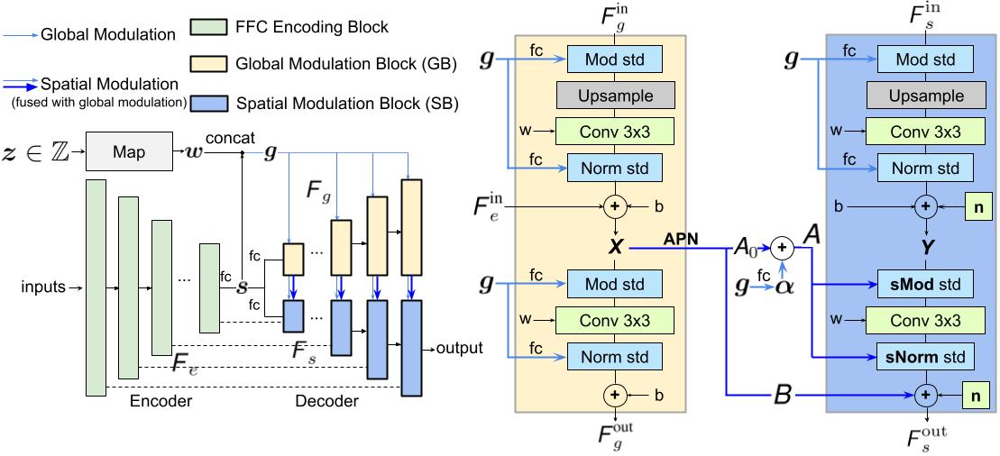

# CM-GAN for Image Inpainting
[arXiv](https://arxiv.org/abs/2203.11947)|[Project](https://github.com/htzheng/CM-GAN-Inpainting/)|[Demo Video](https://github.com/htzheng/CM-GAN-Inpainting/tree/main/figures/demo)

The official repo for **CM-GAN** (**C**ascaded **M**odulation **GAN**) for Image Inpainting. We introduce a new cascaded modulation design that cascades global modulation with spatial adaptive modulation for better hole filling. We also introduce an object-aware training scheme to facilitate better object removal. CM-GAN significantly improves the existing state-of-the-art methods both qualitatively and quantitatively. The online demo will be released soon.

## Example


## Method
We propose cascaded modulation GAN (CM-GAN) with a new modulation design that cascades global modulation with spatial adaptive modulation. To enable this, we also design a new spatial modulation scheme that is compatible to the state-of-the-art GANs ([StyleGAN2](https://github.com/NVlabs/stylegan2-ada-pytorch) and [StyleGAN3](https://github.com/NVlabs/stylegan3)) with weight demodulation. We additionally propose an object-aware training scheme that generates more realistic masks to facilitate the real object removal use case. Please refer to [arXiv](https://arxiv.org/abs/2203.11947) for more technical details.


## Comparisons
CM-GAN reconstructs **better textures**


<!--  -->

**better global structure**


and **better object boundaries**.


## Results
CM-GAN achieves better FID, LPIPS, U-IDS and P-IDS scores.


## Demo
Our inpainting interface suppports interactive selection and removal of distractors. We thank [Qing Liu](https://qliu24.github.io/) for building the nice demo.


## Citation
Please consider cite our paper "CM-GAN: Image Inpainting with Cascaded Modulation GAN and Object-Aware Training" (Haitian Zheng, Zhe Lin, Jingwan Lu, Scott Cohen, Eli Shechtman, Connelly Barnes, Jianming Zhang, Ning Xu, Sohrab Amirghodsi, Jiebo Luo) if you find this project useful for your research. 
```
@article{zheng2022cmgan,
      title={CM-GAN: Image Inpainting with Cascaded Modulation GAN and Object-Aware Training}, 
      author={Haitian Zheng and Zhe Lin and Jingwan Lu and Scott Cohen and Eli Shechtman and Connelly Barnes and Jianming Zhang and Ning Xu and Sohrab Amirghodsi and Jiebo Luo},
      journal={arXiv preprint arXiv:2203.11947},
      year={2022},
}
```

We also have **another interesting project** on [image manipulation](https://arxiv.org/abs/2012.07288). Please also feel free to cite our paper if you find this project interesting.
<p float="left">
  
   
</p>

```
@article{zheng2020semantic,
  title={Semantic layout manipulation with high-resolution sparse attention},
  author={Zheng, Haitian and Lin, Zhe and Lu, Jingwan and Cohen, Scott and Zhang, Jianming and Xu, Ning and Luo, Jiebo},
  journal={arXiv preprint arXiv:2012.07288},
  year={2020}
}
```