# CM-GAN for Image Inpainting (ECCV 2022)
[arXiv](https://arxiv.org/abs/2203.11947)|[pdf paper](CMGAN_camera_ready.pdf)|[appendix](CMGAN_appendix_camera_ready.pdf)|[Project](https://github.com/htzheng/CM-GAN-Inpainting/)
<!-- |[Demo Video](https://github.com/htzheng/CM-GAN-Inpainting/tree/main/figures/demo) -->
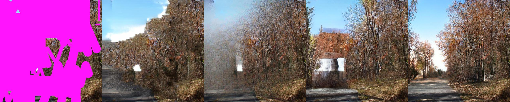
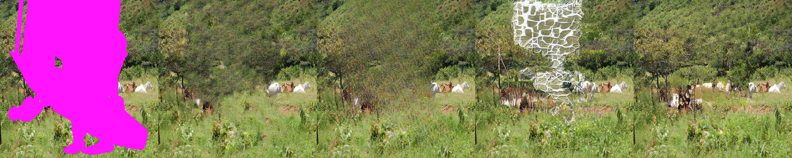
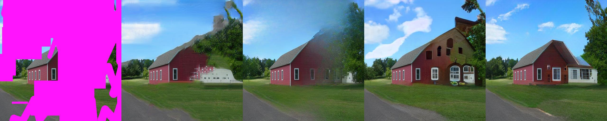
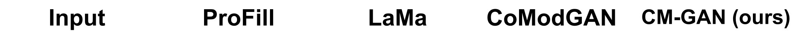


The official repo for **CM-GAN** (**C**ascaded **M**odulation **GAN**) for Image Inpainting. We introduce a new cascaded modulation design that cascades global modulation with spatial adaptive modulation for better hole filling. We also introduce an object-aware training scheme to facilitate better object removal. CM-GAN significantly improves the existing state-of-the-art methods both qualitatively and quantitatively. The online demo will be released soon.

**NEWS (20/07/2022)**: We plan to release the online demo and our dataset soon in the next few days. \
**NEWS (28/07/2022)**: The panoptic segmentation [annotations](https://www.dropbox.com/sh/mxbi2wxad0z1vvq/AADExa5jRRM5UQ_O6EtA8Pnja) on Places2 challange dataset are released. Please refer to the [panoptic annotations](#panoptic-annotations) section for details. \
**NEWS (28/07/2022)**: The [evluation results](https://www.dropbox.com/sh/8y8orhtje98hhki/AACXMGpTf9ag5oBNpixZFmaXa) of CM-GAN is released, which contains the object-aware masks for evaluation and our results. Please refer to the [evaluation and results](#evaluation-and-results) section for details. \
**NEWS (31/07/2022)**: The object-aware mask generation [script](#Code-for-On-the-fly-Object-aware-Mask-Generation) is released.

<!-- ## Example
 -->

## Method
We propose cascaded modulation GAN (CM-GAN) with a new modulation design that cascades global modulation with spatial adaptive modulation. To enable this, we also design a new spatial modulation scheme that is compatible to the state-of-the-art GANs ([StyleGAN2](https://github.com/NVlabs/stylegan2-ada-pytorch) and [StyleGAN3](https://github.com/NVlabs/stylegan3)) with weight demodulation. We additionally propose an object-aware training scheme that generates more realistic masks to facilitate the real object removal use case. Please refer to [our arXiv paper](https://arxiv.org/abs/2203.11947) for more technical details.
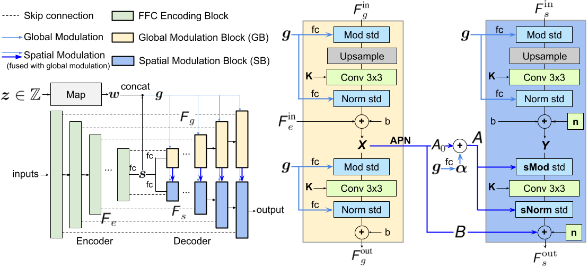

## Comparisons
CM-GAN reconstructs **better textures**
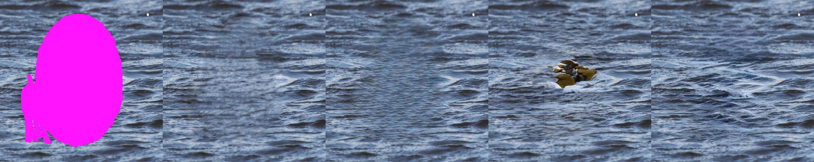
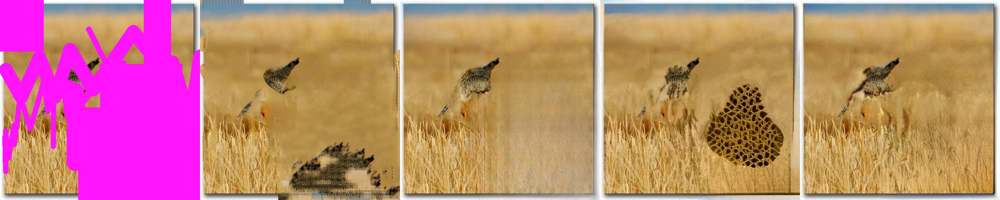
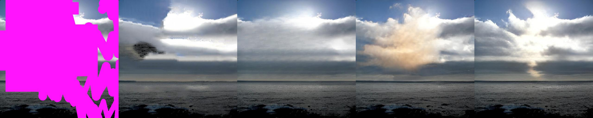
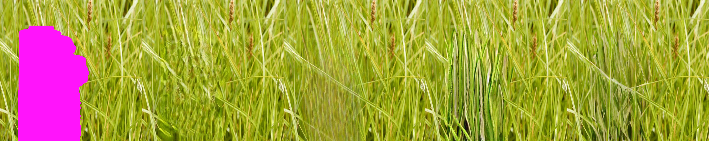
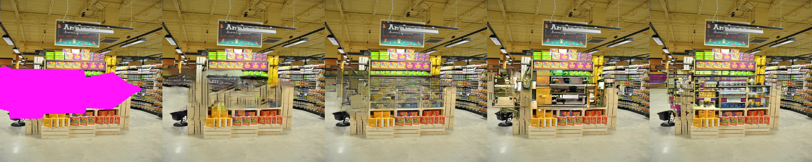
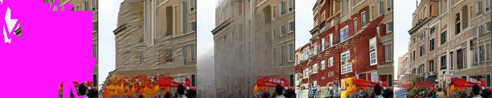

<!--  -->

**better global structure**

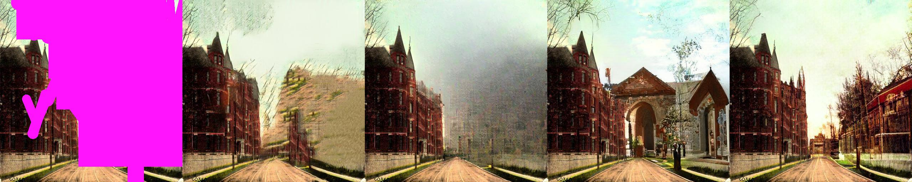
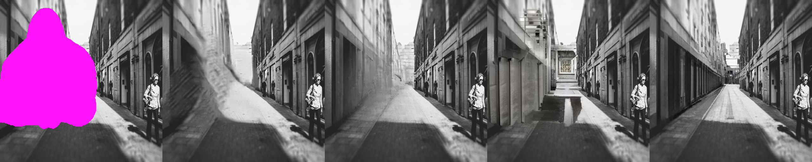
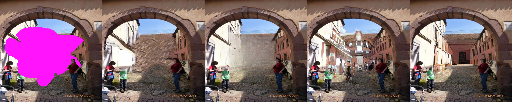
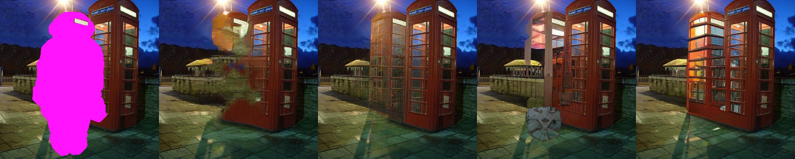

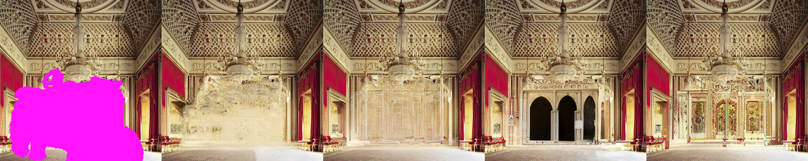
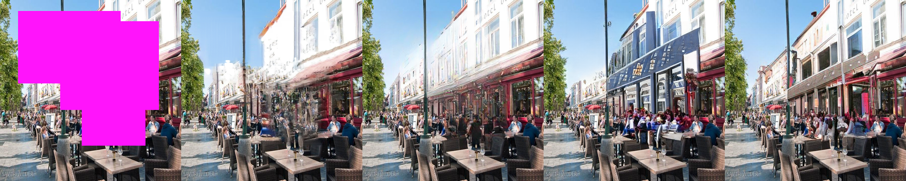
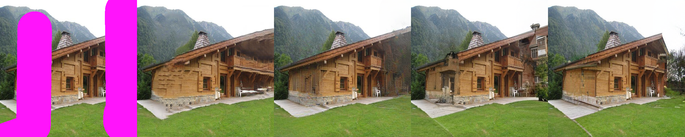


and **better object boundaries**.
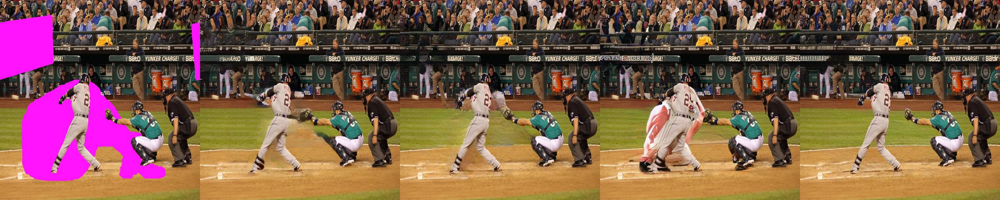
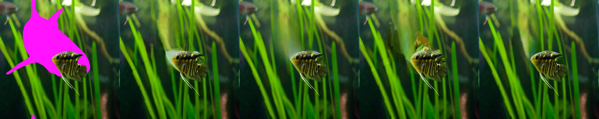
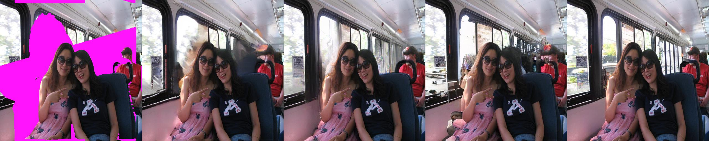
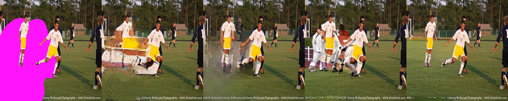
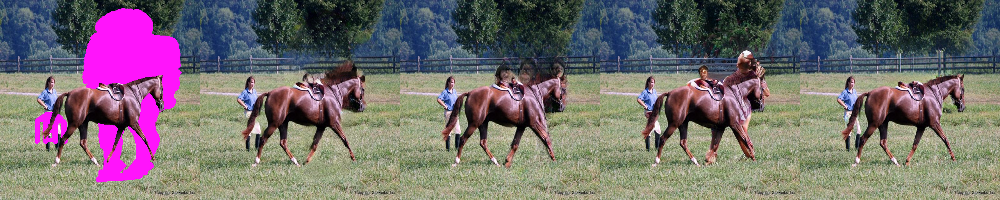


## Results
CM-GAN achieves better FID, LPIPS, U-IDS and P-IDS scores.
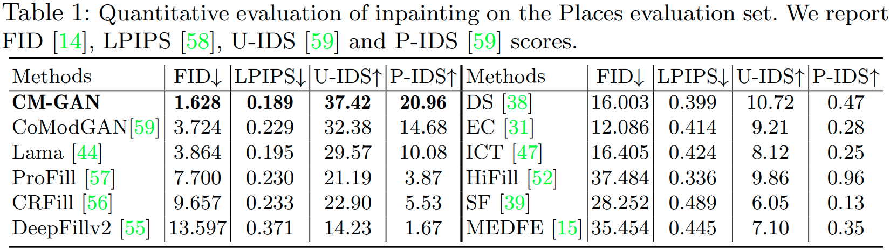

<!-- ## Demo
Our inpainting interface suppports interactive selection and removal of distractors. We thank [Qing Liu](https://qliu24.github.io/) for building the nice demo.
 -->


## Dataset
### Panoptic Annotations
The panoptic segmentation annotations on Places2 are released. Please refer to Dropbox folder [places2_panoptic_annotation](https://www.dropbox.com/sh/mxbi2wxad0z1vvq/AADExa5jRRM5UQ_O6EtA8Pnja) to download the panoptic segmentation annotations on train, evaluation, and test sets (```[data/test/val]_large_panoptic.tar```) and the corresonding file lists (```[data/test/val]_large_panoptic.txt```). Images of Places2-challange dataset can be downloaded at the [Places2 official website](http://places2.csail.mit.edu/index.html).

### Format of Panoptic Annotation
The panoptic annotation of each image is represented by a ```png``` image and a ```json``` file. The png image saves the ```id``` of each segment, and JSON file saves ```category_id```, ```isthing``` of id. ```Isthing``` represents whether the segment is a thing/stuff. To know more details about the data format, please run the following python script
```python
from detectron2.data import MetadataCatalog 
panoptic_metadata = MetadataCatalog.get('coco_2017_val_panoptic_separated')
```
and refer to [the demo script](#Code-for-On-the-fly-Object-aware-Mask-Generation), which provides a detailed example on how to generate object-aware masks from the panoptic annotations. The metadata ```panoptic_metadata``` is also saved at ```mask_generator/_panoptic_metadata.txt```

### Evaluation and CM-GAN Results
The evluation set for inpainting is released. Please refer to [evaluation](https://www.dropbox.com/sh/8y8orhtje98hhki/AACXMGpTf9ag5oBNpixZFmaXa) folder on Dropbox, which contains the Places evluation set images at resolution 512x512 (image.tar), the object-aware masks for all evluation images (mask.tar), and the results of CM-GAN (cmgan-perc64.tar).

## Code for On-the-fly Object-aware Mask Generation
The ```mask_generator/mask_generator.py``` contains the class and example for on-the-fly object-aware mask generation. Please run
```console
cd mask_generator
python mask_generator.py
```
to generate a random mask and the masked image, which are save to ```mask_generator/output_mask.png``` and ```mask_generator/output_masked_image.png```, respectively. An visual example is shown below:
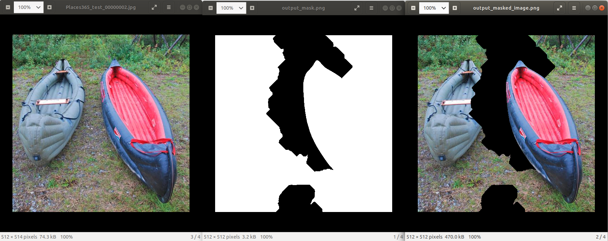
Note that we use 4 object masks only for illstration and the full object mask dataset is from [PriFill, ECCV'20](https://arxiv.org/abs/2005.11742).

## Citation
Please consider cite our paper "CM-GAN: Image Inpainting with Cascaded Modulation GAN and Object-Aware Training" (Haitian Zheng, Zhe Lin, Jingwan Lu, Scott Cohen, Eli Shechtman, Connelly Barnes, Jianming Zhang, Ning Xu, Sohrab Amirghodsi, Jiebo Luo) if you find this work useful for your research. 
```
@article{zheng2022cmgan,
      title={CM-GAN: Image Inpainting with Cascaded Modulation GAN and Object-Aware Training}, 
      author={Haitian Zheng and Zhe Lin and Jingwan Lu and Scott Cohen and Eli Shechtman and Connelly Barnes and Jianming Zhang and Ning Xu and Sohrab Amirghodsi and Jiebo Luo},
      journal={arXiv preprint arXiv:2203.11947},
      year={2022},
}
```

We also have **another project** on [image manipulation](https://arxiv.org/abs/2012.07288). Please also feel free to cite this work if you find it interesting.
<p float="left">
  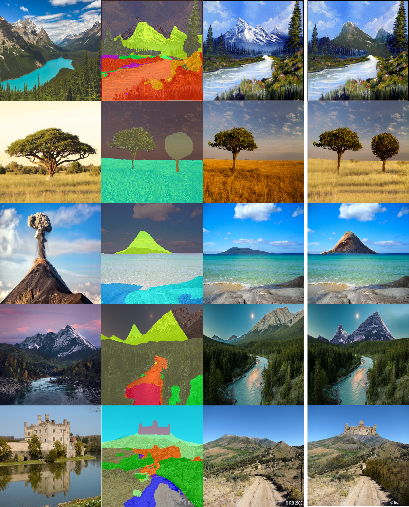
  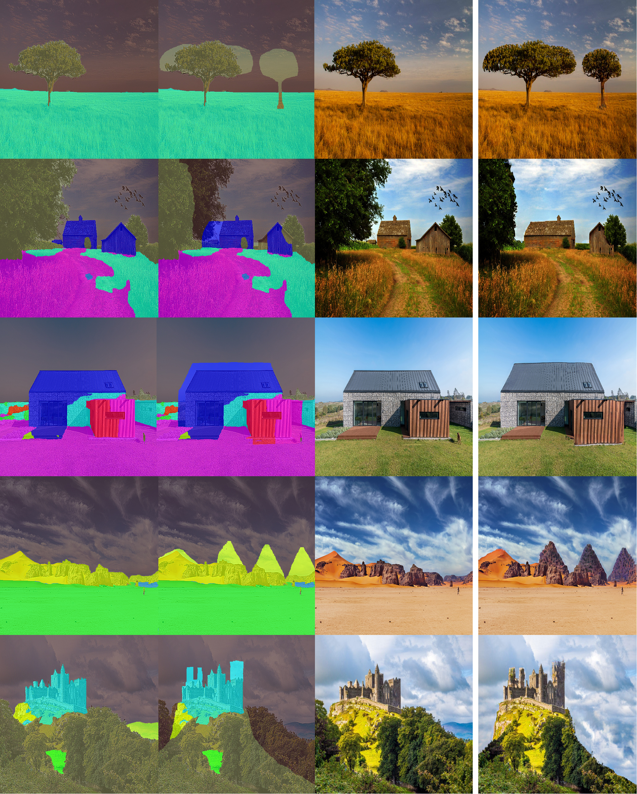 
</p>

```
@article{zheng2020semantic,
  title={Semantic layout manipulation with high-resolution sparse attention},
  author={Zheng, Haitian and Lin, Zhe and Lu, Jingwan and Cohen, Scott and Zhang, Jianming and Xu, Ning and Luo, Jiebo},
  journal={arXiv preprint arXiv:2012.07288},
  year={2020}
}
```